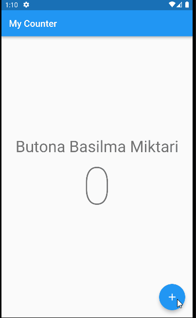
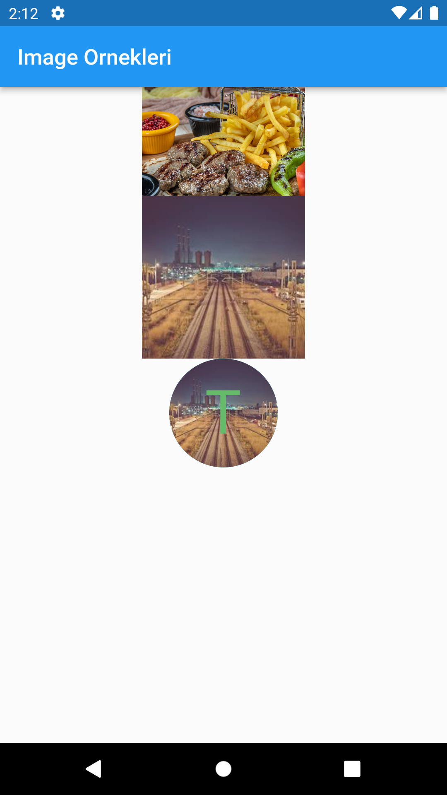
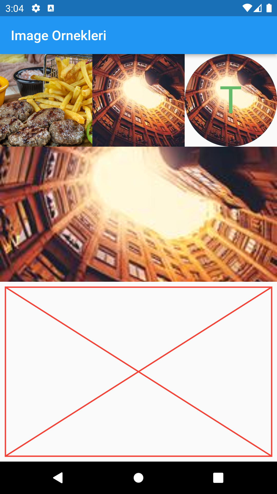
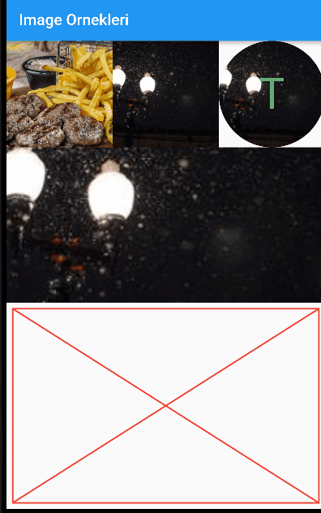
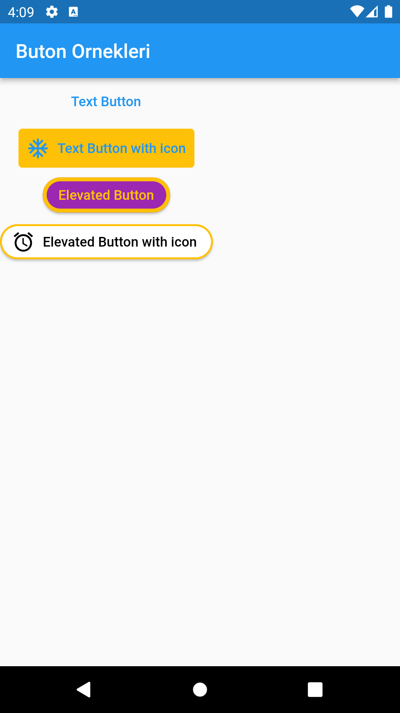
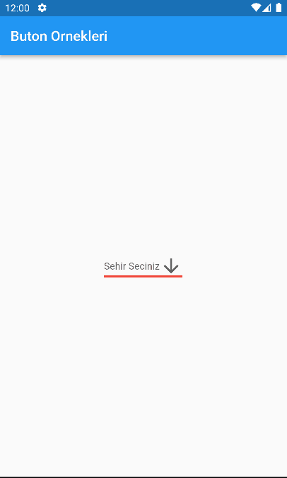
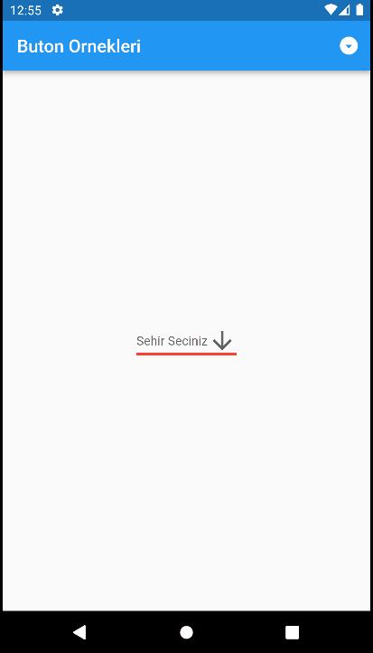
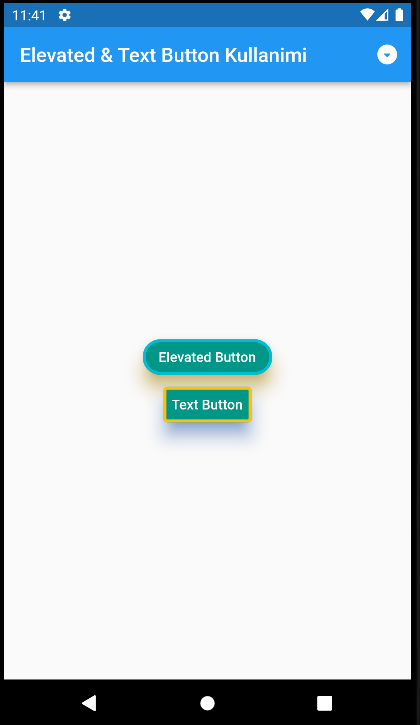
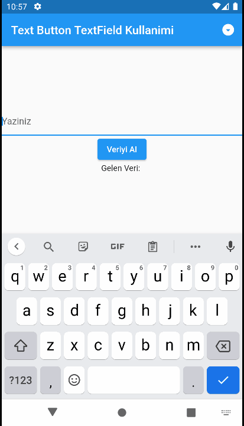
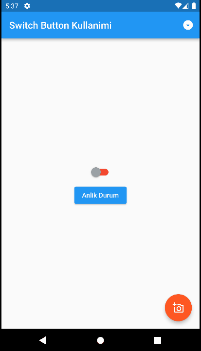

# flutter

Flutter temel widget ve uygulamalar 

#### Sayac uygulamasi

#### image calismalari

#### IntrinsicHeight - FadeInImage- Placeholder kullanimi

#### Buton Ornekleri

#### Text Button TextField Kullanimi

#### Switch Button Kullanimi

